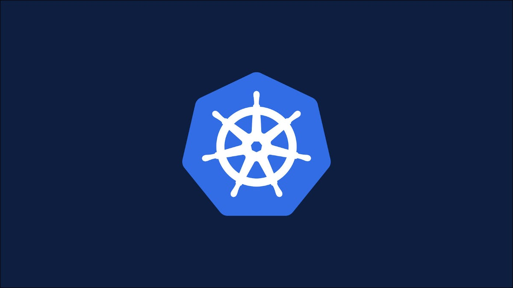

# Setting up Kubernetes in (not so) hard way


*Cluster Preparation Guide for CKA*

Using kubeadm


## Consideration

- Virtual Machines are created in Azure
- One client machine has Public IP others are Private
- IP Range
- Weaver
- Docker
- Kubeadm
- One master VM
- Two Worker VM
- One Client VM

## Steps

### 1-Create Azure Resources

- Resource Group
- Storage Account (optional)
- Virtual Network
- Subnet
- NIC
- Public IP Address
- Three Virtual Machines

Azure resources Setup [Script](script-aug21/01-azure-cluster.sh)

### 2-Prepare the Virtual Machines

Login to the Client VM using Public IP then connect to the other three Virtual Machines.

Install & Configure [as uuperuser]

- IP tables
- Docker
- Kubectl, Kubeadm, Kubelet

Here is the [Script](script-aug21/02-all-node-setup.sh)

### 3-Master Node

Here is the [Script](script-aug21/03-master-setup.sh)

***Post-setup for master***

Follow the instruction given in the outout of the successful setup,

- Copy kubeconfig to the folder
  
```sh
mkdir -p $HOME/.kube
sudo cp -i /etc/kubernetes/admin.conf $HOME/.kube/config
sudo chown $(id -u):$(id -g) $HOME/.kube/config
```

- Copy the `kubeadm join` command
- Install the pod network plugin
  `kubectl apply -f "https://cloud.weave.works/k8s/net?k8s-version=$(kubectl version | base64 | tr -d '\n')"`

### 4-Join Worker Node

Using the token generated from previous step connect this to the Kubernetes master.

> If you forget generate one by running `sudo kubeadm token create --print-join-command`

Worker node setup [Script](script-aug21/04-worker-setup.sh)

### 5-Confirm the Setup

In master node run

```bash
kubectl get nodes 
```

## Resources

- Kubeadm [Installation](https://kubernetes.io/docs/setup/production-environment/tools/kubeadm/install-kubeadm/)
- Docker [Installation](https://docs.docker.com/engine/install/#server)
- Weaver [Installation](https://www.weave.works/docs/net/latest/kubernetes/kube-addon/)

---

*Prepared and maintained by Wriju Ghosh for CKA Exam playground*
Tested as of *11-August-2021*
