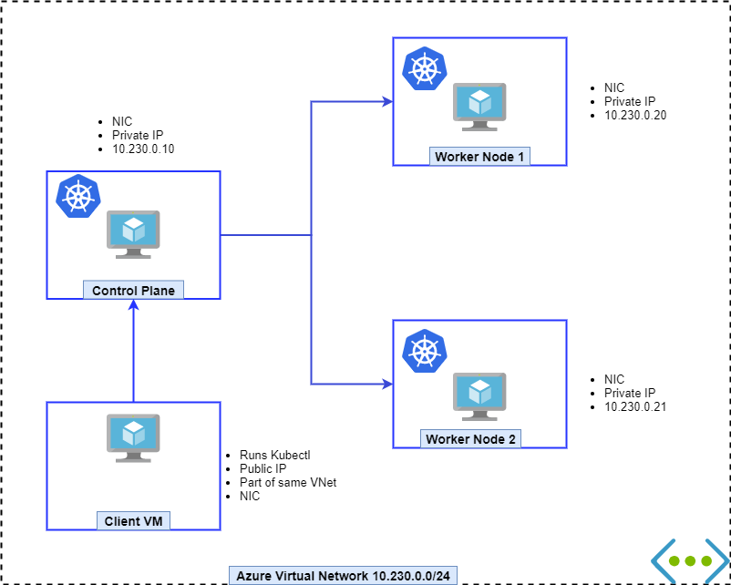

# Setting up Kubernetes in (not so) hard way

*Cluster Preparation Guide for CKA*

Using kubeadm


## Consideration

- Virtual Machines are created in Azure under Azure VNet
- One client machine has Public IP others are Private
- IP Range
- Docker
- Kubeadm
- One master VM
  - Weaver as Pod network plugin
- Two Worker VM
- One Client VM with Public IP



## Steps

### 1-Create Azure Resources

- Resource Group
- Storage Account (optional)
- Virtual Network
- Subnet
- NIC
- Public IP Address
- Three Virtual Machines (for Kubernetes)
- One Virtual machine as client to connect the K8s cluster

Azure resources Setup [Script](script-aug21/01-azure-cluster.sh)

### 2-Prepare the Virtual Machines

Login to the Client VM using Public IP then connect to the other three Virtual Machines.

Install & Configure [as super user]

- IP tables
- Docker
- Kubectl, Kubeadm, Kubelet

Here is the [Script](script-aug21/02-all-node-setup.sh)

### 3-Master Node

Here is the [Script](script-aug21/03-master-setup.sh)

***Post-setup for master***

Follow the instruction given in the outout of the successful setup,

- Copy kubeconfig to the folder
  
```sh
mkdir -p $HOME/.kube
sudo cp -i /etc/kubernetes/admin.conf $HOME/.kube/config
sudo chown $(id -u):$(id -g) $HOME/.kube/config
```

- Copy the `kubeadm join` command
- Install the pod network plugin
  `kubectl apply -f "https://cloud.weave.works/k8s/net?k8s-version=$(kubectl version | base64 | tr -d '\n')"`

### 4-Join Worker Node

Using the token generated from previous step connect this to the Kubernetes master.

> If you forget it then generate a new one by running `sudo kubeadm token create --print-join-command`

Worker node setup [Script](script-aug21/04-worker-setup.sh)

### 5-Confirm the Setup

Configure the client machine for kubectl

>**Best Practices** It is not recommended to run `kubectl` in master or worker node. You should run it from outside of the K8s cluster.

In client machine create a folder `~/.kube` by

```bash
mkdir -p $HOME/.kube
```

Then copy the `~/.kube/config` from master node to client machine using `scp`

`scp config cka@clientIP:$HOME/.kube`

Then run this command in client machine

```bash
kubectl get nodes 
```

If the above shows list of nodes and in ready state then we are good to go.

Create a pod to test,

```bash
kubectl run nginx --image=nginx
```

Then check the list of pods

```bash
kubectl get pods
```

### 6 - Some useful Azure CLI Commands

Get the list of running VMs in a Resource Group

```bash
resourceGroup='rg-cka2'
az vm list -d -g $resourceGroup --query "[].{name:name,powerState:powerState}" -o table
```

Start all the VMs in a Resrouce Group

```bash
resourceGroup='rg-cka2'
az vm start --ids $(az vm list -g $resourceGroup --query "[].id" -o tsv)
```

Stop (deallocate) all the VMs in a Resource Group

```bash
resourceGroup='rg-cka2'
az vm deallocate --ids $(az vm list -g $resourceGroup --query "[].id" -o tsv)
```

### 7 - Clean up Azure Resources

If you delete the resource group it will delete all the resources inside

```bash
# Will ask for confirmation
az group delete -n wriju

# Anyc delete 
az group delete -n wriju --no-wait 

```

## Resources

- Kubeadm [Installation](https://kubernetes.io/docs/setup/production-environment/tools/kubeadm/install-kubeadm/)
- Docker [Installation](https://docs.docker.com/engine/install/#server)
- Weaver [Installation](https://www.weave.works/docs/net/latest/kubernetes/kube-addon/)
- CKA Exam [Curriculum](https://github.com/cncf/curriculum)

---

Prepared and maintained by Wriju Ghosh for CKA Exam playground

*Contribute*
[https://github.com/wrijugh/cka-setup-guide](https://github.com/wrijugh/cka-setup-guide)

Web [https://wrijugh.github.io/cka-setup-guide/](https://wrijugh.github.io/cka-setup-guide/)

Tested as of *31-August-2021*
